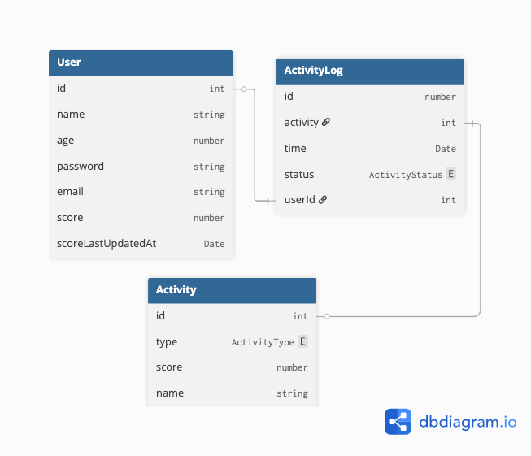
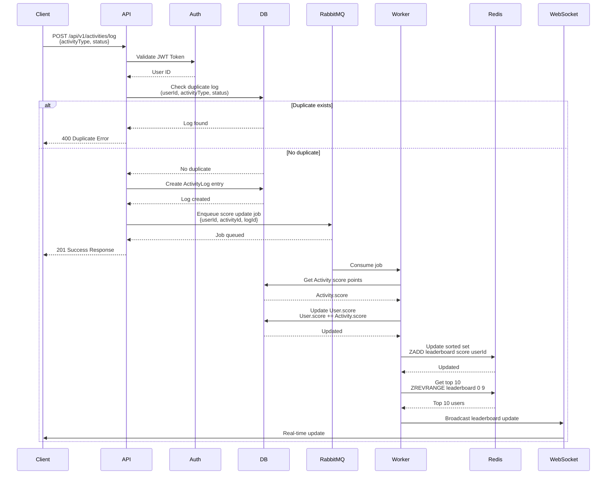

# Problem 6 - Live Scoreboard API Module Specification

## Overview

This module implements a real-time scoreboard system that displays the top 10 users' scores with live updates. The system tracks user activities, validates them to prevent malicious score manipulation, and updates the scoreboard in real-time using WebSockets.

## Software Requirements

1. **Scoreboard Display**: Show top 10 users' scores on a website
2. **Live Updates**: Real-time updates when scores change
3. **Activity Tracking**: Users can complete actions that increase their score
4. **Score Update API**: Endpoint to receive activity completion notifications
5. **Security**: Prevent unauthorized score manipulation

## System Architecture

### Components

1. **REST API**: Activity log submission endpoint
2. **Message Queue (RabbitMQ)**: Asynchronous score processing
3. **Database (MongoDB/PostgreSQL)**: Persistent storage for users, activities, and logs
4. **Redis Cache**: Sorted set for top 10 leaderboard
5. **WebSocket Server**: Real-time scoreboard updates

## Database Schema



### User Table

**User Indexes:**
- Primary key on `id`
- Unique index on `email`
- Index on `score`

### Activity Table

**Activity Indexes:**
- Primary key on `id`
- Index on `type` (for activity lookups)

### ActivityType Enum

```typescript
enum ActivityType {
  MODULE_OPEN = "MODULE_OPEN",          
  FIRST_WORKOUT = "FIRST_WORKOUT"        
}
```

**ActivityLog Indexes:**
- Primary key on `id`
- Composite unique index on `(userId, activity, status)` - Prevents duplicate logs
- Index on `userId` (for user activity history)
- Index on `activity` (for activity analytics)
- Index on `time` (for time-based queries)

### ActivityStatus Enum

```typescript
enum ActivityStatus {
  STARTED = "STARTED",           // Activity was initiated
  COMPLETED = "COMPLETED"        // Activity was completed
}
```

## API Specifications

### 1. Create Activity Log

**Endpoint:** `POST /api/v1/activities/log`

**Description:** Records an activity log entry for a user. Validates for duplicate entries and enqueues score update job.

**Authentication:** Required (JWT token or session-based)

**Request Headers:**
```
Authorization: Bearer <token>
Content-Type: application/json
```

**Request Body:**
```json
{
  "activityType": "MODULE_OPEN" | "FIRST_WORKOUT",
  "status": "STARTED" | "COMPLETED"
}
```

**Validation Rules:**
- `activityType` must be a valid ActivityType enum value
- `status` must be a valid ActivityStatus enum value
- User must be authenticated
- Check for existing log with same `userId`, `activityType`, and `status`
  - If exists, return error (prevents duplicate scoring)

**Success Response (201 Created):**
```json
{
  "success": true,
  "message": "Activity log created successfully",
  "data": {
    "logId": 12345,
    "userId": 100,
    "activityType": "MODULE_OPEN",
    "status": "COMPLETED",
    "timestamp": "2024-01-15T10:30:00Z"
  }
}
```

**Error Responses:**

**400 Bad Request - Duplicate Activity Log:**
```json
{
  "success": false,
  "error": "DUPLICATE_ACTIVITY_LOG",
  "message": "Activity log already exists for this user with the same type and status"
}
```

**400 Bad Request - Invalid Input:**
```json
{
  "success": false,
  "error": "VALIDATION_ERROR",
  "message": "Invalid activity type or status",
  "details": {
    "activityType": "Invalid enum value"
  }
}
```

**401 Unauthorized:**
```json
{
  "success": false,
  "error": "UNAUTHORIZED",
  "message": "Authentication required"
}
```

**404 Not Found - Activity Not Found:**
```json
{
  "success": false,
  "error": "ACTIVITY_NOT_FOUND",
  "message": "Activity type does not exist"
}
```

### 2. Get Top 10 Leaderboard

**Endpoint:** `GET /api/v1/leaderboard/top10`

**Description:** Retrieves the top 10 users by score from Redis cache.

**Authentication:** Optional (public endpoint)

**Response (200 OK):**
```json
{
  "success": true,
  "data": {
    "leaderboard": [
      {
        "userId": 100,
        "name": "John Doe",
        "score": 1500,
        "rank": 1
      },
      {
        "userId": 101,
        "name": "Jane Smith",
        "score": 1450,
        "rank": 2
      }
      // ... up to 10 entries
    ],
    "lastUpdated": "2024-01-15T10:30:00Z"
  }
}
```

### 3. WebSocket Connection

**Endpoint:** `WS /ws/leaderboard`

**Description:** WebSocket connection for real-time leaderboard updates.

**Connection Flow:**
1. Client establishes WebSocket connection
2. Server sends current top 10 leaderboard immediately
3. Server broadcasts updates whenever leaderboard changes
4. Client receives updates and refreshes UI

**Message Format (Server → Client):**
```json
{
  "type": "LEADERBOARD_UPDATE",
  "data": {
    "leaderboard": [
      {
        "userId": 100,
        "name": "John Doe",
        "score": 1500,
        "rank": 1
      }
      // ... top 10 entries
    ],
    "timestamp": "2024-01-15T10:30:00Z"
  }
}
```

**Heartbeat (Server → Client):**
```json
{
  "type": "PING",
  "timestamp": "2024-01-15T10:30:00Z"
}
```

## System Flow Diagram



## Security Considerations

### 1. Authentication & Authorization
- **JWT Token Validation**: All activity log requests must include valid JWT token
- **User Context**: Extract user ID from token, never trust client-provided user ID
- **Rate Limiting**: Implement rate limiting per user to prevent spam (e.g., 100 requests/minute)

### 2. Duplicate Prevention
- **Database Constraint**: Composite unique index on `(userId, activity, status)` prevents duplicates at DB level
- **Application Check**: Additional check before inserting to provide better error messages
- **Idempotency Key**: Consider adding idempotency key for retry scenarios

### 3. Score Manipulation Prevention
- **Server-Side Only**: Score updates only happen via RabbitMQ worker, never directly from API
- **Activity Validation**: Verify activity exists and has valid score before processing
- **Audit Trail**: All score changes are logged in ActivityLog table with timestamps
- **Transaction Safety**: Use database transactions for score updates to prevent race conditions

### 4. Input Validation
- **Schema Validation**: Use Joi or similar for request validation
- **Enum Validation**: Strict validation of ActivityType and ActivityStatus
- **SQL Injection**: Use parameterized queries/ORM to prevent injection attacks

## Performance Considerations

1. **Redis Caching**: Leaderboard stored in Redis for fast reads
2. **Async Processing**: Score updates via RabbitMQ prevent API blocking
3. **Database Indexes**: Proper indexes on frequently queried fields
4. **Connection Pooling**: Database and Redis connection pooling
5. **WebSocket Efficiency**: Broadcast only when leaderboard actually changes

## Deployment Considerations

1. **Environment Variables:**
   - Database connection string
   - Redis connection string
   - RabbitMQ connection string
   - JWT secret key
   - WebSocket server port

2. **Scaling:**
   - Horizontal scaling for API servers
   - Multiple RabbitMQ workers for job processing
   - Redis cluster for high availability
   - WebSocket server load balancing (sticky sessions)

3. **Monitoring:**
   - API response times
   - RabbitMQ queue depth
   - Redis memory usage
   - WebSocket connection count
   - Error rates

## Additional Improvements & Recommendations

### 1. Enhanced Security
- **IP-based Rate Limiting**: Additional layer of protection
- **Activity Cooldown**: Prevent same activity being logged multiple times
- **Admin Override**: Admin API to override correpted scores

### 2. Data Integrity
- **Database Transactions**: Use database transactions to makesure data integrity
- **Idempotency**: Add idempotency key to prevent duplicate processing on retries
- **Dead Letter Queue**: Add a retry/debug mechanism for failed items in the queue

### 3. Feature Enhancements
- **Historical Leaderboard**: Store previous leaderboards.
- **User Ranking**: As a 11th item in the API response add the current users rank. Or add another API to get current user's rank
- **Activity Analytics**: Dashboard for performance analysis (previous or current performances)
- **Notifications**: Notify users when they lose ranks

### 4. Developer Experience
- **API Documentation**: OpenAPI/Swagger documentation
- **Logging**: Structured logging with correlation IDs
- **Error Tracking**: Integration with error tracking service (Sentry)
- **Metrics**: Prometheus metrics for monitoring

## Technology Stack Recommendations

- **Backend Framework**: Express.js / Nest.js / Fastify
- **Database**: MongoDB (NoSQL) or PostgreSQL (SQL)
- **ORM/ODM**: Mongoose (MongoDB) or TypeORM/Prisma (PostgreSQL)
- **Message Queue**: RabbitMQ or AWS SQS
- **Cache**: Redis
- **WebSocket**: Socket.io or native WebSocket
- **Authentication**: JWT with refresh tokens
- **Validation**: Joi
- **Logging**: Winston or bunyan
- **Testing**: Jest / Mocha

## API Endpoints Summary

| Method | Endpoint | Description | Auth Required |
|--------|----------|-------------|---------------|
| POST | `/api/v1/activities/log` | Create activity log | Yes |
| GET | `/api/v1/leaderboard/top10` | Get top 10 leaderboard | No |
| GET | `/api/v1/leaderboard/user/:userId` | Get user's rank | No |
| WS | `/ws/leaderboard` | WebSocket for live updates | Optional |